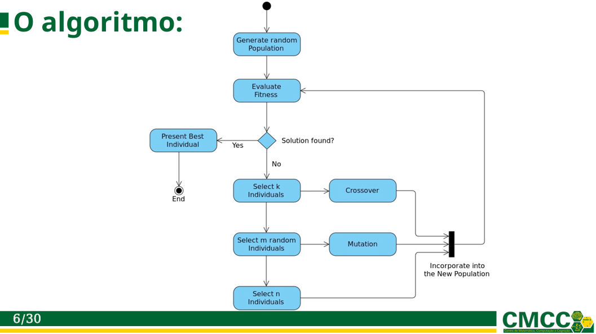

# EvolutiveKnapsack

**Problema da mochila evolutiva**


Universidade Federal do ABC - Bacharelado em Ciência e Tecnologia Sistemas Inteligentes 2024/Q3

Lenin Cristi

lenin.cristi@aluno.ufabc.edu.br

## Resumo

**Resumo. Experimento de resolução do problema da mochila usando algoritmos genéticos**

**Abstract. Experiment on Solving the Knapsack Problem Using Genetic Algorithms**

## Objetivos

O objetivo principal deste estudo é investigar a aplicação de algoritmos genéticos (AG) para resolver o problema da mochila, um problema clássico de otimização combinatória.

### O que é o problema da mochila

Para o estudo atual, o problema foi enunciado da seguinte maneira

> Você fará uma viagem a um acampamento durante o final de semana e precisa decidir quais itens levar. Como você só dispõe de uma mochila com capacidade para 15 kg, decidiu incluir somente os itens que maximizem a soma do valor em R$ dos itens, sem ultrapassar o limite de peso

Itens possíveis na mochila

| Nº  | Item                        | Valor (R$) | Peso (kg) |
|-----|-----------------------------|------------|-----------|
| 1   | Barraca                    | 150,00     | 3,5       |
| 2   | Saco de dormir             | 100,00     | 2,0       |
| 3   | Isolante térmico           | 50,00      | 0,5       |
| 4   | Colchão inflável           | 80,00      | 1,0       |
| 5   | Lanterna                   | 30,00      | 0,2       |
| 6   | Kit de primeiros socorros  | 20,00      | 0,5       |
| 7   | Repelente de insetos       | 15,00      | 0,1       |
| 8   | Protetor solar             | 20,00      | 0,2       |
| 9   | Canivete                   | 10,00      | 0,1       |
| 10  | Mapa e bússola             | 25,00      | 0,3       |
| 11  | Garrafa de água            | 15,00      | 1,8       |
| 12  | Filtro de água             | 50,00      | 0,5       |
| 13  | Comida (ração liofilizada) | 50,00      | 3,0       |
| 14  | Fogão de camping           | 70,00      | 1,5       |
| 15  | Botijão de gás             | 30,00      | 1,2       |
| 16  | Prato, talheres e caneca   | 20,00      | 0,5       |
| 17  | Roupas (conjunto)          | 80,00      | 1,5       |
| 18  | Calçados (botas)           | 120,00     | 2,0       |
| 19  | Toalha                     | 20,00      | 0,5       |
| 20  | Kit de higiene pessoal     | 30,00      | 0,5       |

### Requisitos para a solução

- O problema deve ser resolvido implementando um algoritmo genético.

- A representação do problema em cromossomos, a função de ajuste (fitness) e os operadores genéticos (mutação, crossover e o mecanismo de seleção) são parte da solução.

## Metodologia

### Definições iniciais

A solução foi pensada para o problema específico apresentado, o da mochila, e a fim de diminuir a complexidade da solução ela não é generalizada para estruturas de indivíduos arbitrárias.

### Lista de itens & Peso

A lista de itens possíveis foi modelada contendo o ID do item (ordem do item na lista original), Nome do item, Valor (R$), Peso (kg).

O peso é uma variável simples, mas é critério de corte para a função de fitness.

```python
# Lista de itens: ID, Nome do item, Valor (R$), Peso (kg)
items = [
    (1, "Barraca", 150.0, 3.5),
    (2, "Saco de dormir", 100.0, 2.0),
    (3, "Isolante térmico", 50.0, 0.5),
    (4, "Colchão inflável", 80.0, 1.0),
    (5, "Lanterna", 30.0, 0.2),
    (6, "Kit de primeiros socorros", 20.0, 0.5),
    (7, "Repelente de insetos", 15.0, 0.1),
    (8, "Protetor solar", 20.0, 0.2),
    (9, "Canivete", 10.0, 0.1),
    (10, "Mapa e bússola", 25.0, 0.3),
    (11, "Garrafa de água", 15.0, 1.8),
    (12, "Filtro de água", 50.0, 0.5),
    (13, "Comida (ração liofilizada)", 50.0, 3.0),
    (14, "Fogão de camping", 70.0, 1.5),
    (15, "Botijão de gás", 30.0, 1.2),
    (16, "Prato, talheres e caneca", 20.0, 0.5),
    (17, "Roupas (conjunto)", 80.0, 1.5),
    (18, "Calçados (botas)", 120.0, 2.0),
    (19, "Toalha", 20.0, 0.5),
    (20, "Kit de higiene pessoal", 30.0, 0.5)
]

# Capacidade máxima da mochila em kg
max_weight = 15.0
```

### Indivíduos & Cromossomos

O indivíduo foi criado como uma tupla, sendo o primeiro item a matriz 1D com 20 posições, correspondentes ao índice da lista de itens original e podendo assumir os valores 0 e 1 e o segundo item sendo o fitness associado ao indivíduo.

Vista de um cromossomo de solução encontrado, é possível ver a lista de itens e o fitness associado

```
Cromossomo: ([1, 1, 1, 1, 1, 1, 1, 1, 1, 1, 0, 1, 0, 1, 0, 1, 1, 1, 0, 1], 870.0)
```

### Função de ajuste (fitness)

A função de avaliação da mochila é relativamente simples, ela soma os pesos dos itens e os valores na mochila e retorna uma penalidade de -1 se o peso for excedido, caso contrário retorna o valor somado como ganho.

```python
def fitness_function(individual):
    total_value = 0
    total_weight = 0
    for gene, item in zip(individual, items):
        if gene == 1:
            total_value += item[2]
            total_weight += item[3]
    return total_value if total_weight <= max_weight else -1
```

### Valores iniciais utilizados nos operadores

Inicialmente foram definidos os seguintes operadores para a implementação do código

| Parâmetro                    | Nome do parâmetro               | Valor        | Descrição                                                                |
|------------------------------|----------------------------------|--------------|--------------------------------------------------------------------------|
| População inicial             | `population_size`               | 300          | Número de indivíduos na população inicial                                |
| Número de Gerações           | `num_generations`               | 40           | Número de iterações que o algoritmo genético realizará                   |
| Tamanho do torneio            | `tournament_size`               | 3            | Tamanho do torneio, ou número de indivíduos selecionados para reprodução |
| Taxa de Crossover            | `crossover_probability`         | 0.5          | Define a probabilidade de que dois indivíduos (pais) se cruzem           |
| Taxa de Mutação              | `mutation_probability`          | 0.2          | Define a probabilidade de que um indivíduo sofra uma mutação             |
| Probabilidade individual de mutação | `individual_probability` | 0.05         | Probabilidade de mutação de cada gene em um indivíduo (bit flip)          |
| Melhores indivíduos          | `best_individuals`              | 5            | Número de indivíduos selecionados ao final                               |

### Geração da população

A população inicial **U** é gerada criando indivíduos com cromossomos randomicamente preenchidos por [0,1] na quantidade `population_size` e armazenados numa lista base que contém uma tupla contendo o cromossomo e o resultado da função de fitness que inicialmente é zerado.

Esta estrutura de lista base também é usada para armazenar cada geração, o número de gerações é definido por `num_generations`.

Cada geração tem um número de melhores indivíduos controlado por `best_individuals`.

```python
def population_generate(population_size, chromosome_length):
    return [(random.choices([0, 1], k=chromosome_length), 0) for _ in range(population_size)]
```

Este mecanismo de list comprehension [para i em n ...] foi usado em todo o código, mas não é tão enigmático quanto parece, aqui ele simplesmente esta atribuindo 1 ou 0 pelo tamanho do cromossomo (criando um cromossomo) para um range que representa o tamanho da população (n cromossomos).

### Mecanismo de seleção

O mecanismo de seleção foi inspirado num esquema apresentado na Aula 4, slide 6 de estratégia evolucionária, mas com algumas adaptações.

<br />
Figura 1: CEC 2024 Q3, Aula 4 Slide 6, UFABC

### Esquema original

No esquema apresentado são selecionados três grupos, um elitista de melhores indivíduos, um selecionado em torneio e um randomizado, sendo os dois primeiros para crossover e mutação respectivamente.

### Adaptações no esquema

A alteração feita faz com que na divisão dos dois primeiros grupos, um elitista e um por torneio, sejam aplicados operadores de reprodução e mutação em cada grupo e depois no grupo resultante da combinação entre os três.

O operador de seleção utiliza separações baseadas em `tournament_size` indivíduos.

- A primeira é um conjunto de indivíduos de melhor fitness **B** da população atual **P** (elitismo).

- A segunda é um conjunto de indivíduos de melhor fitness dentro de uma seleção randômica **T** sobre o espaço **P** (torneio).

- A terceira é um conjunto de indivíduos dentro de uma seleção randômica **R** sobre o espaço **P** (aleatório).

Esta seleção tripla visa permitir <mark>exploração</mark> de novas soluções enquanto mantem indivíduos destinados a <mark>explotação</mark> de soluções locais.

```python
def population_select_triple(population, tournament_size):
    B = sorted(population, key=lambda x: x[1], reverse=True)[:tournament_size]  # Elitismo
    T = [random.choice(sorted(random.sample(population, tournament_size), key=lambda x: x[1], reverse=True)) for _ in range(tournament_size)] # Torneio
    R = random.sample(population, tournament_size) # Aleatório
    return B, T, R
```

Desmembrando em cada grupo

```python
B = sorted(population, key=lambda x: x[1], reverse=True)[:tournament_size]  # Elitismo
```

A população é selecionada pelo fitness inverso (o individuo é uma tupla: posição 0 cromossomo, 1 fitness associado) com quantidade correspondente ao tamanho do torneio

```python
T = [random.choice(sorted(random.sample(population, tournament_size), key=lambda x: x[1], reverse=True)) for _ in range(tournament_size)] # Torneio
```

Aqui temos duas operações ocorrendo, na periferia uma seleção de tamanho do torneio e no núcleo a mesma operação de B (sorted, reverse, tournament_size) mas baseada numa seleção randômica e não na população diretamente.

```python
R = random.sample(population, tournament_size) # Aleatório
```

A operação mais simples das três, uma seleção randômica com o tamanho do torneio

### Ação dos operadores em cada geração

Cada população (**B**, **T**, **R**) passa pelo operador de reprodução em `crossover_probability`% indivíduos, combinados em pares randomicamente selecionados, gerando outros dois indivíduos.

Cada população (**B**, **T**, **R**) passa pelo operador de mutação em `mutation_probability`% indivíduos com chance de `individual_probability`% de troca de cada gene por bit flip simples em cada indivíduo.

As três populações (**B**, **T**, **R**) são unidas **BTR** e passam pelo operador de reprodução em `crossover_probability`% indivíduos, combinados em pares randomicamente selecionados, gerando outros dois indivíduos.

As três populações (**B**, **T**, **R**) são unidas **BTR** e passam pelo operador de mutação em `mutation_probability`% indivíduos com chance de `individual_probability`% de troca de cada gene por bit flip simples em cada indivíduo.

Estes operadores de reprodução e mutação agindo na própria população e entre populações tem a intenção de explorar mais soluções aplicando elitismo e torneio em fatias de cada geração.

Para selecionar os melhores indivíduos em cada conjunto é feita a ordenação do conjunto pelo fitness e para selecionar os indivíduos randomicamente é feito uma seleção randômica simples sobre o conjunto.

### Operador de reprodução

O operador de reprodução é uma função que recebe dois indivíduos e um limiar de cruzamento, com probabilidade de `crossover_probability`% de ocorrer o cruzamento.

A função de cruzamento se ativada faz com que cada gene seja escolhido aleatoriamente de um dos dois pais com probabilidade igual para ambos, se não ativada os dois indivíduos são replicados na saída do operador.

Este operador sempre gera dois indivíduos.

```python
def operator_mating(parent1, parent2, crossover_probability):
    if random.random() < crossover_probability:
        child1 = [random.choice(genes) for genes in zip(parent1, parent2)]
        child2 = [random.choice(genes) for genes in zip(parent1, parent2)]
    else:
        child1, child2 = parent1[:], parent2[:]
    return child1, child2
```

Se o random gerado for menor que a probabilidade de crossover, representando assim os % de chance de ativação da função, ocorre seleção randômica de genes de um combinado dos pais gerado pela zip.

### Operador de mutação

O operador de mutação é uma função que recebe um indivíduo e dois limiares de mutação, com probabilidade de `mutation_probability`% de alterá-lo.

A função de mutação se ativada opera nos genes do indivíduo com `individual_probability`% de chance de alterar cada gene, se não ativada o indivíduo é replicado na saída do operador.

Este operador sempre gera um indivíduo.

```python
def operator_xmen(individual, mutation_probability, individual_probability):
    if random.random() < mutation_probability:
        return [1 - gene if random.random() < individual_probability else gene for gene in individual]
    return individual[:]
```

Se o random gerado for menor que a probabilidade de mutação, representando assim os % de chance de ativação da função, ocorre que para cada gene, se um segundo random for menor que a probabilidade individual de mutação ele é flipado (1 - 1 = 0 ou 1 - 0 = 1)

### Implementação

A implementação completa esta no **Anexo 2** e corresponde ao notebook [KnapSackEvolutive](notebooks/KnapSackEvolutive.ipynb), com as funções e operadores apresentados até aqui.

### Primeiras execuções

As primeiras rodadas do algoritmo mostraram convergência rápida, mas nem sempre para os valores ótimos encontrados com o uso de bibliotecas prontas como o DEAP.

Valores de referência obtidos com a biblioteca DEAP no experimento [KnapSack](notebooks/KnapSack.ipynb).

> Valor total: R$870.00<br/>
> Peso total: 14.90kg<br/>
> Tempo de execução (evolução somente): 0.2194 segundos

#### Rodada 1

Segue como um exemplo a saída da Rodada 1

> Melhores indivíduos:<br/>
> Cromossomo: [1, 1, 1, 1, 1, 1, 1, 1, 1, 1, 0, 1, 0, 1, 0, 1, 1, 1, 0, 0], Fitness: 840.0, Valor Total: 840.00, Peso Total: 14.40<br/>
> Cromossomo: [1, 1, 1, 1, 1, 0, 0, 1, 1, 1, 0, 1, 0, 1, 1, 1, 1, 1, 0, 0], Fitness: 835.0, Valor Total: 835.00, Peso Total: 15.00<br/>
> Cromossomo: [1, 1, 1, 1, 1, 0, 0, 1, 1, 1, 0, 1, 0, 1, 1, 1, 1, 1, 0, 0], Fitness: 835.0, Valor Total: 835.00, Peso Total: 15.00<br/>
> Cromossomo: [1, 1, 1, 1, 1, 0, 0, 1, 1, 1, 0, 1, 0, 1, 1, 1, 1, 1, 0, 0], Fitness: 835.0, Valor Total: 835.00, Peso Total: 15.00<br/>
> Cromossomo: [1, 1, 1, 1, 1, 0, 0, 1, 1, 1, 0, 1, 0, 1, 1, 1, 1, 1, 0, 0], Fitness: 835.0, Valor Total: 835.00, Peso Total: 15.00

Representação visual do primeiro individuo da Rodada 1

| Nome do item             | Valor (R$) | Peso (kg) |
|--------------------------|------------|-----------|
| Barraca                 | 150.0      | 3.5       |
| Saco de dormir          | 100.0      | 2.0       |
| Isolante térmico        | 50.0       | 0.5       |
| Colchão inflável        | 80.0       | 1.0       |
| Lanterna                | 30.0       | 0.2       |
| Kit de primeiros socorros| 20.0      | 0.5       |
| Repelente de insetos    | 15.0       | 0.1       |
| Protetor solar          | 20.0       | 0.2       |
| Canivete                | 10.0       | 0.1       |
| Mapa e bússola          | 25.0       | 0.3       |
| Filtro de água          | 50.0       | 0.5       |
| Fogão de camping        | 70.0       | 1.5       |
| Prato, talheres e caneca| 20.0       | 0.5       |
| Roupas (conjunto)       | 80.0       | 1.5       |
| Calçados (botas)        | 120.0      | 2.0       |


Valor total: R$840.00<br/>
Peso total: 14.40kg<br/>
Tempo de execução (evolução somente): 0.0060 segundos

#### Rodada 2

Segue como um exemplo a saída da Rodada 2

> Melhores indivíduos:<br/>
> Cromossomo: [1, 1, 1, 1, 1, 1, 1, 1, 1, 1, 0, 1, 0, 1, 0, 0, 1, 1, 1, 1], Fitness: 870.0, Valor Total: 870.00, Peso Total: 14.90<br/>
> Cromossomo: [1, 1, 1, 1, 1, 0, 1, 1, 1, 1, 0, 1, 0, 1, 0, 0, 1, 1, 1, 1], Fitness: 850.0, Valor Total: 850.00, Peso Total: 14.40<br/>
> Cromossomo: [1, 1, 1, 1, 1, 0, 1, 1, 1, 1, 0, 1, 0, 1, 0, 0, 1, 1, 1, 1], Fitness: 850.0, Valor Total: 850.00, Peso Total: 14.40<br/>
> Cromossomo: [1, 1, 1, 1, 1, 0, 1, 1, 1, 1, 0, 1, 0, 1, 0, 0, 1, 1, 1, 1], Fitness: 850.0, Valor Total: 850.00, Peso Total: 14.40<br/>
> Cromossomo: [1, 1, 1, 1, 1, 0, 1, 1, 1, 1, 0, 1, 0, 1, 0, 0, 1, 1, 1, 1], Fitness: 850.0, Valor Total: 850.00, Peso Total: 14.40

Representação visual do primeiro individuo da Rodada 2

| Nome do item               | Valor (R$) | Peso (kg) |
|----------------------------|------------|-----------|
| Barraca                   | 150.0      | 3.5       |
| Saco de dormir            | 100.0      | 2.0       |
| Isolante térmico          | 50.0       | 0.5       |
| Colchão inflável          | 80.0       | 1.0       |
| Lanterna                  | 30.0       | 0.2       |
| Kit de primeiros socorros | 20.0       | 0.5       |
| Repelente de insetos      | 15.0       | 0.1       |
| Protetor solar            | 20.0       | 0.2       |
| Canivete                  | 10.0       | 0.1       |
| Mapa e bússola            | 25.0       | 0.3       |
| Filtro de água            | 50.0       | 0.5       |
| Fogão de camping          | 70.0       | 1.5       |
| Roupas (conjunto)         | 80.0       | 1.5       |
| Calçados (botas)          | 120.0      | 2.0       |
| Toalha                    | 20.0       | 0.5       |
| Kit de higiene pessoal    | 30.0       | 0.5       |

Valor total: R$870.00<br/>
Peso total: 14.90kg<br/>
Tempo de execução (evolução somente): 0.0055 segundos

### Tentativas de ajuste

Numa tentativa de chegar aos valores de referência, foram alterados os seguintes parâmetros, marcados em negrito, para aumentar o campo de busca, aumentar as gerações produzidas e o número de indivíduos em cada rodada de reprodução e mutação.

| Parâmetro                    | Nome do parâmetro               | Valor        | Descrição                                                                |
|------------------------------|----------------------------------|--------------|--------------------------------------------------------------------------|
| População inicial             | `population_size`               | **1000**          | Número de indivíduos na população inicial                                |
| Número de Gerações           | `num_generations`               | **50**           | Número de iterações que o algoritmo genético realizará                   |
| Tamanho do torneio            | `tournament_size`               | **15**            | Tamanho do torneio, ou número de indivíduos selecionados para reprodução |
| Taxa de Crossover            | `crossover_probability`         | 0.5          | Define a probabilidade de que dois indivíduos (pais) se cruzem           |
| Taxa de Mutação              | `mutation_probability`          | 0.2          | Define a probabilidade de que um indivíduo sofra uma mutação             |
| Probabilidade individual de mutação | `individual_probability` | 0.05         | Probabilidade de mutação de cada gene em um indivíduo (bit flip)          |
| Melhores indivíduos          | `best_individuals`              | 5            | Número de indivíduos selecionados ao final                               |

Com estes ajustes, de três rodadas subsequentes, todas convergiram para o ótimo encontrado no DEAP

> Melhores indivíduos:<br/>
> Cromossomo: [1, 1, 1, 1, 1, 0, 1, 1, 1, 1, 0, 1, 0, 1, 0, 1, 1, 1, 1, 1], Fitness: 870.0, Valor Total: 870.00, Peso Total: 14.90<br/>
> Cromossomo: [1, 1, 1, 1, 1, 0, 1, 1, 1, 1, 0, 1, 0, 1, 0, 1, 1, 1, 1, 1], Fitness: 870.0, Valor Total: 870.00, Peso Total: 14.90<br/>
> Cromossomo: [1, 1, 1, 1, 1, 0, 1, 1, 1, 1, 0, 1, 0, 1, 0, 1, 1, 1, 1, 1], Fitness: 870.0, Valor Total: 870.00, Peso Total: 14.90<br/>
> Cromossomo: [1, 1, 1, 1, 1, 0, 1, 1, 1, 1, 0, 1, 0, 1, 0, 1, 1, 1, 1, 1], Fitness: 870.0, Valor Total: 870.00, Peso Total: 14.90<br/>
> Cromossomo: [1, 1, 1, 1, 1, 0, 1, 1, 1, 1, 0, 1, 0, 1, 0, 1, 1, 1, 1, 1], Fitness: 870.0, Valor Total: 870.00, Peso Total: 14.90

Representação visual dos indivíduos de rodadas subsequentes

| Nome do item               | Valor (R$) | Peso (kg) |
|----------------------------|------------|-----------|
| Barraca                   | 150.0      | 3.5       |
| Saco de dormir            | 100.0      | 2.0       |
| Isolante térmico          | 50.0       | 0.5       |
| Colchão inflável          | 80.0       | 1.0       |
| Lanterna                  | 30.0       | 0.2       |
| Repelente de insetos      | 15.0       | 0.1       |
| Protetor solar            | 20.0       | 0.2       |
| Canivete                  | 10.0       | 0.1       |
| Mapa e bússola            | 25.0       | 0.3       |
| Filtro de água            | 50.0       | 0.5       |
| Fogão de camping          | 70.0       | 1.5       |
| Prato, talheres e caneca  | 20.0       | 0.5       |
| Roupas (conjunto)         | 80.0       | 1.5       |
| Calçados (botas)          | 120.0      | 2.0       |
| Toalha                    | 20.0       | 0.5       |
| Kit de higiene pessoal    | 30.0       | 0.5       |


Valor total: R$870.00<br />
Peso total: 14.90kg<br />
Tempo de execução (evolução somente): 0.0410 segundos

## Discussão

As primeiras soluções encontravam mínimos locais e convergiam para um conjunto de indivíduos não homogêneo, com soluções em torno do mínimo teórico atingido com o uso de DEAP mas com tempos muito menores na ordem de ~2.73% do tempo de convergência do DEAP (0.2194 segundos):

> Valor total: R$840.00 / Peso total: 14.40kg em 0.0060 segundos<br/>
> Valor total: R$870.00 / Peso total: 14.90kg em 0.0055 segundos

Com um ajuste de parâmetros, foram encontradas rodadas com saídas homogêneas de indivíduos selecionados com o seguinte valor:

> Valor total: R$870.00 / Peso total: 14.90kg em 0.0410 segundos

O que é uma solução igual a teórica ótima encontrada no DEAP mas ainda de convergência menor na ordem de ~18.68% do tempo de convergência do DEAP.

Mesmo a solução sem ajuste, é interessante pelo consumo de memória e ciclos de computação consideravelmente menor e talvez possa ser empregada em sistemas de tempo real com tomada de decisão que tenham margem de erro numa decisão que tem limites muito baixos para tempos de resposta (exemplos: descarte de frames de vídeo numa transmissão de tempo real, resposta ativa para ajuste de termostato num fluxo de telemetria etc.)

Já a solução com ajuste, convergiu mais rápido e encontrou as mesmas soluções no mínimo teórico (assumindo que o DEAP encontrou a solução ótima), isso pode ser devido as abstrações necessárias ao DEAP que consegue manipular estruturas genéricas e ao algoritmo atual ter sido feito especificamente para o fim do problema. A estratégia de divisão e cruzamento entre populações proposta aqui pode ter contribuído decisivamente, mas testes adicionais com outras estratégias seriam necessários para sacramentar isso. É temerário derivar só por estes testes que a solução proposta aqui seja melhor quer o DEAP, mas ela é animadora em termos do problema específico tratado aqui pois convergiu muito mais rápido.

## Anexo 1 - Como gerar o ambiente para reproduzir os experimentos

Vamos mostrar a seguir um exemplo de como criar o ambiente necessário usando o gerenciador de ambientes e pacotes Anaconda como base com o arquivo environments.yml neste repositório.

### Instalando o conda

Utilize a referência oficial Anaconda para instalar o miniconda no seu ambiente https://docs.anaconda.com/miniconda/install/

### Criando o ambiente

Para criar o ambiente com os pacotes base a partir do arquivo

```bash
conda env create -f environment.yml
```

### Ativando o ambiente

Após a instalação do ambiente base, ative ele com

```bash
conda activate evol
```

### DEAP (não requerido)

Abaixo um comando de como instalar a biblioteca

```bash
pip install deap
```

## Anexo 2 - KnapSackEvolutive

Código somente, para a versão integral visite o notebook

```python
import random
import time
import pandas as pd

# Lista de itens: ID, Nome do item, Valor (R$), Peso (kg)
items = [
    (1, "Barraca", 150.0, 3.5),
    (2, "Saco de dormir", 100.0, 2.0),
    (3, "Isolante térmico", 50.0, 0.5),
    (4, "Colchão inflável", 80.0, 1.0),
    (5, "Lanterna", 30.0, 0.2),
    (6, "Kit de primeiros socorros", 20.0, 0.5),
    (7, "Repelente de insetos", 15.0, 0.1),
    (8, "Protetor solar", 20.0, 0.2),
    (9, "Canivete", 10.0, 0.1),
    (10, "Mapa e bússola", 25.0, 0.3),
    (11, "Garrafa de água", 15.0, 1.8),
    (12, "Filtro de água", 50.0, 0.5),
    (13, "Comida (ração liofilizada)", 50.0, 3.0),
    (14, "Fogão de camping", 70.0, 1.5),
    (15, "Botijão de gás", 30.0, 1.2),
    (16, "Prato, talheres e caneca", 20.0, 0.5),
    (17, "Roupas (conjunto)", 80.0, 1.5),
    (18, "Calçados (botas)", 120.0, 2.0),
    (19, "Toalha", 20.0, 0.5),
    (20, "Kit de higiene pessoal", 30.0, 0.5)
]

# Capacidade máxima da mochila em kg
max_weight = 15.0

chromosome_length = len(items)
population_size = 1000
num_generations = 50
tournament_size = 15
crossover_probability = 0.5
mutation_probability = 0.2
individual_probability = 0.05
best_individuals = 5

# Calcula o valor total dos itens na mochila e penaliza se o peso máximo for excedido
def fitness_function(individual):
    total_value = 0
    total_weight = 0
    for gene, item in zip(individual, items):
        if gene == 1:
            total_value += item[2]
            total_weight += item[3]
    return total_value if total_weight <= max_weight else -1

# Geração inicial da população
def population_generate(population_size, chromosome_length):
    return [
        (random.choices([0, 1], k=chromosome_length), 0) for _ in range(population_size)
    ]

# Avaliação da população
def population_evaluate(population, fitness_func):
    for i, (chromosome, _) in enumerate(population):
        population[i] = (chromosome, fitness_func(chromosome))
    return population

# Seleção de indivíduos (elitismo, torneio, aleatório)
def population_select_triple(population, tournament_size):
    B = sorted(population, key=lambda x: x[1], reverse=True)[:tournament_size]  # Elitismo
    T = [random.choice(sorted(random.sample(population, tournament_size), key=lambda x: x[1], reverse=True)) for _ in range(tournament_size)] # Torneio
    R = random.sample(population, tournament_size) # Aleatório
    return B, T, R

# Operador de reprodução
def operator_mating(parent1, parent2, crossover_probability):
    if random.random() < crossover_probability:
        child1 = [random.choice(genes) for genes in zip(parent1, parent2)]
        child2 = [random.choice(genes) for genes in zip(parent1, parent2)]
    else:
        child1, child2 = parent1[:], parent2[:]
    return child1, child2

# Operador de mutação
def operator_xmen(individual, mutation_probability, individual_probability):
    if random.random() < mutation_probability:
        return [1 - gene if random.random() < individual_probability else gene for gene in individual]
    return individual[:]

# Geração inicial e avaliação inicial da população
population = population_generate(population_size, chromosome_length)
population = population_evaluate(population, fitness_function)

# Registra o tempo de início
start_time = time.time()

# Loop principal do algoritmo genético com o número de gerações
for generation in range(num_generations):

    # Seleção dos três grupos
    B, T, R = population_select_triple(population, tournament_size)

    # Reprodução nos trê grupos
    offspring_B = []
    for _ in range(len(B) // 2):
        p1, p2 = random.sample(B, 2)
        child1, child2 = operator_mating(p1[0], p2[0], crossover_probability)
        offspring_B.append((child1, 0))
        offspring_B.append((child2, 0))

    offspring_T = []
    for _ in range(len(T) // 2):
        p1, p2 = random.sample(T, 2)
        child1, child2 = operator_mating(p1[0], p2[0], crossover_probability)
        offspring_T.append((child1, 0))
        offspring_T.append((child2, 0))

    offspring_R = []
    for _ in range(len(R) // 2):
        p1, p2 = random.sample(R, 2)
        child1, child2 = operator_mating(p1[0], p2[0], crossover_probability)
        offspring_R.append((child1, 0))
        offspring_R.append((child2, 0))

    # Mutação nos três grupos
    xmen_B = [(operator_xmen(ind[0], mutation_probability, individual_probability), ind[1]) for ind in B]

    xmen_T = [(operator_xmen(ind[0], mutation_probability, individual_probability), ind[1]) for ind in T]

    xmen_R = [(operator_xmen(ind[0], mutation_probability, individual_probability), ind[1]) for ind in R]

    # Combinação dos grupos
    combined = B + T + R

    # Reprodução cruzada
    offspring_BTR = []
    for _ in range(len(combined) // 2):
        p1, p2 = random.sample(combined, 2)
        child1, child2 = operator_mating(p1[0], p2[0], crossover_probability)
        offspring_BTR.append((child1, 0))
        offspring_BTR.append((child2, 0))

    # Mutação cruzada
    xmen_BTR = [(operator_xmen(ind[0], mutation_probability, individual_probability), 0) for ind in combined]

    descendants = offspring_B + offspring_T + offspring_R + offspring_BTR + xmen_B + xmen_T + xmen_R + xmen_BTR

    # Reavaliação da população
    population = population_evaluate(descendants, fitness_function)

    # Ordenação e manutenção dos melhores
    population = sorted(population, key=lambda x: x[1], reverse=True)[:population_size]

# Registra o tempo de término
end_time = time.time()

# Calcula o tempo total de execução
execution_time = end_time - start_time

# Seleção dos melhores indivíduos finais
top_individuals = sorted(population, key=lambda x: x[1], reverse=True)[:best_individuals]

# Lista melhores indivíduos
print("Melhores indivíduos:")
for ind in top_individuals:
    selected_items = [items[i] for i, gene in enumerate(ind[0]) if gene == 1]
    total_value = sum(item[2] for item in selected_items)
    total_weight = sum(item[3] for item in selected_items)
    print(f"Cromossomo: {ind[0]}, Fitness: {ind[1]}, Valor Total: {total_value:.2f}, Peso Total: {total_weight:.2f}")

# Seleciona o melhor indivíduo.
best_individual = top_individuals[0]
print("Cromossomo:", best_individual)

# Identifica os itens selecionados no melhor indivíduo.
selected_items = [items[i] for i, gene in enumerate(best_individual[0]) if gene == 1]
total_value = sum(item[2] for item in selected_items)
total_weight = sum(item[3] for item in selected_items)

# Criação do DataFrame com os itens selecionados pelo melhor indivíduo
selected_items_data = [{
    'Nome do item': item[1],
    'Valor (R$)': item[2],
    'Peso (kg)': item[3]
} for item in selected_items]

df_selected_items = pd.DataFrame(selected_items_data)

print("Itens selecionados:")
df_selected_items.head(len(items))

# Imprime o valor total dos itens na mochila.
print(f"Valor total: R${sum(item[2] for item in selected_items):.2f}")

# Imprime o peso total dos itens na mochila.
print(f"Peso total: {sum(item[3] for item in selected_items):.2f}kg")

# Imprime o tempo de execução
print(f"Tempo de execução (evolução somente): {execution_time:.4f} segundos")
```

## Referências

**Computação Evolutiva e Conexionista Conceitos básicos e Algoritmos Evolucionários - Aula 02**
Prof. Hugo Puertas de Araújo, Computação Evolutiva e Conexionista 2024, UFABC

**Computação Evolutiva e Conexionista Algoritmos Genéticos - Aula 03**
Prof. Hugo Puertas de Araújo, Computação Evolutiva e Conexionista 2024, UFABC

**Computação Evolutiva e Conexionista Estratégias Evolutivas - Aula 04**
Prof. Hugo Puertas de Araújo, Computação Evolutiva e Conexionista 2024, UFABC

DEAP - Distributed Evolutionary Algorithms in Python<br>
https://github.com/DEAP/deap

François-Michel De Rainville, Félix-Antoine Fortin, Marc-André Gardner, Marc Parizeau and Christian Gagné, "DEAP -- Enabling Nimbler Evolutions", SIGEVOlution, vol. 6, no 2, pp. 17-26, February 2014.<br>
http://vision.gel.ulaval.ca/~cgagne/pubs/sigevolution2014.pdf

Félix-Antoine Fortin, François-Michel De Rainville, Marc-André Gardner, Marc Parizeau and Christian Gagné, "DEAP: Evolutionary Algorithms Made Easy", Journal of Machine Learning Research, vol. 13, pp. 2171-2175, jul 2012.<br>
https://jmlr.csail.mit.edu/papers/v13/fortin12a.html

François-Michel De Rainville, Félix-Antoine Fortin, Marc-André Gardner, Marc Parizeau and Christian Gagné, "DEAP: A Python Framework for Evolutionary Algorithms", in !EvoSoft Workshop, Companion proc. of the Genetic and Evolutionary Computation Conference (GECCO 2012), July 07-11 2012.<br>
http://vision.gel.ulaval.ca/~cgagne/pubs/deap-gecco-2012.pdf

DEAP 1.4.1 documentation » Examples » One Max Problem<br>
https://deap.readthedocs.io/en/master/examples/ga_onemax.html

DEAP 1.4.1 documentation » Examples » Knapsack Problem: Inheriting from Set<br>
https://deap.readthedocs.io/en/master/examples/ga_knapsack.html

___

CMCC - Universidade Federal do ABC (UFABC) - Santo André - SP - Brasil
